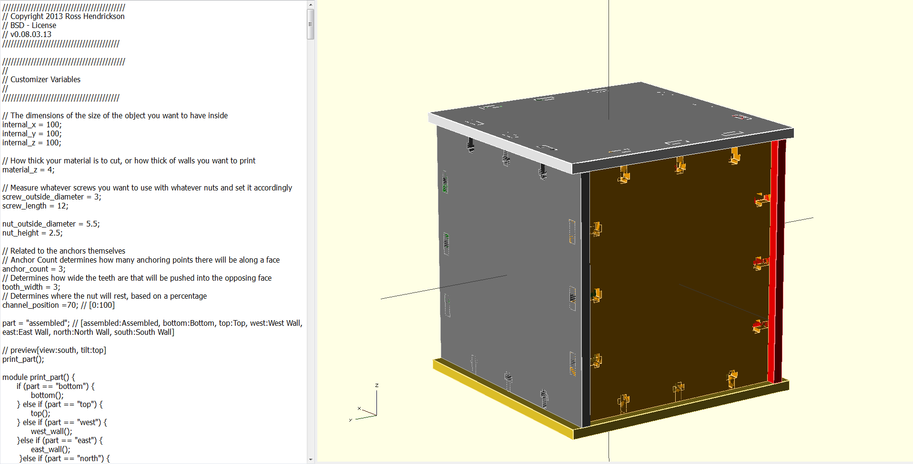
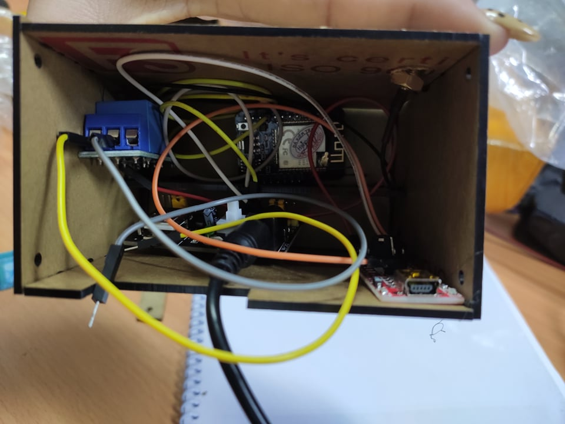
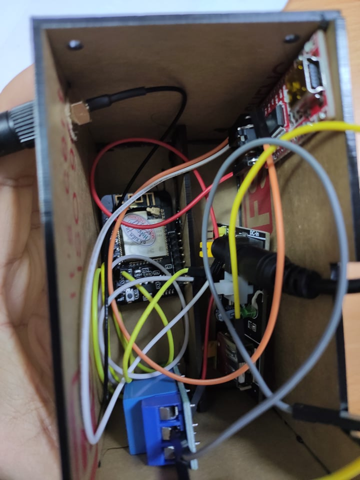

# ESP32-FaceID-DoorLock

A professional-grade smart door lock system featuring real-time face recognition using the ESP32-CAM module. This project integrates hardware components like relays, electronic locks, and status LEDs with an embedded web server for monitoring and access control.

## ┬┐ Features
- **Real-time Face Recognition**: Uses ESP-WHO framework capabilities for identifying authorized users.
- **Remote Monitoring**: Built-in web server to view the camera feed and manage access.
- **Hardware Integration**: Controls 12V electronic locks via relay modules.
- **Visual Feedback**: LED indicators for system status (authorized/unauthorized).

## ┬┐ Hardware Components
The system consists of the following key components:
- **ESP32-CAM**: The core processing unit with camera and Wi-Fi.
- **Relay Module**: To trigger the 12V electronic lock.
- **Electronic Lock (12V)**: Heavy-duty solenoid lock.
- **Buck Converter**: To step down voltage for the ESP32.
- **Antenna**: For improved Wi-Fi range.

Detailed component images can be found in the [media/components](media/components) directory.

## ┬┐ Project Structure
- `firmware/`: Contains the Arduino/C++ source code (`.ino`, `.cpp`, `.h`).
- `media/`: Project demonstration photos, box designs, and a [video demo](media/video-demo.mp4).
- `docs/`: Technical presentation and design documents.

## ┬┐ Getting Started

### 1. Firmware Installation
1. Open `firmware/CameraWebServer.ino` in the Arduino IDE.
2. Select **AI Thinker ESP32-CAM** board.
3. Configure your Wi-Fi credentials in the source code.
4. Flash the code to your ESP32-CAM.

### 2. Wiring
Refer to the diagrams in the `media/components` folder for connecting the relay, buck converter, and electronic lock.

## ┬┐ Demonstration
Watch the system in action:

---
*Created by DinhLucent - 2022 (Updated 2026)*